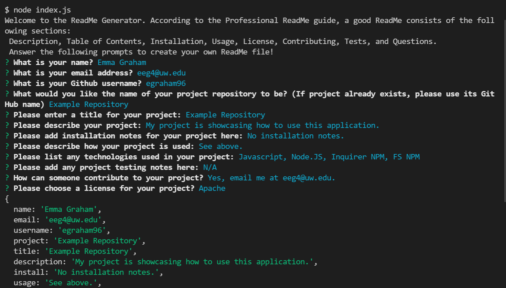

# Homework Assignment 9-ReadMe Generator

## Description:
This week's homework required us to create a command-line application that dynamically generates a professional README.md file from a user's input using the NPM Inquirer package. The application will be invoked by using the node index.js in the user's command line. The ReadME.md file generated by this application adheres to the standards of the Professional ReadMe guide and consists of the following sections: Description, Table of Contents, Installation, Usage, License, Contributing, Tests, and Questions.

## Installation Instructions:
Download this repository. Install the inquirer and FS node modules (For example, "npm install inquirer"). Run the file by typing "node index" into your terminal.

## Built With:
* Javascript
* [Node JS](https://nodejs.org/en/)
* [Inquirer NPM](https://www.npmjs.com/package//inquirer)
* [FS NPM](https://www.npmjs.com/package/fs)

## Deployed Links:
* [Link to GitHub Repo](https://github.com/egraham96/Read-Me-Generator)

## Preview of Working Site:

[Example ReadMe Generated By This Application](https://github.com/egraham96/homework-assignment-09/blob/main/Develop/Assets/GeneratedExampleReadMe.md)

[Video Showing How Application Can Be Used](https://drive.google.com/file/d/1wdyNE25-Ajihqkbtn06rYIpnfbU3bH2x/view)

## How to Contribute:
If you'd like to contribute to this project please send an email to eeg4@uw.edu or message me on github: egraham96.

## How to Test the Application:
Please see installation instructions above. 

## License:

